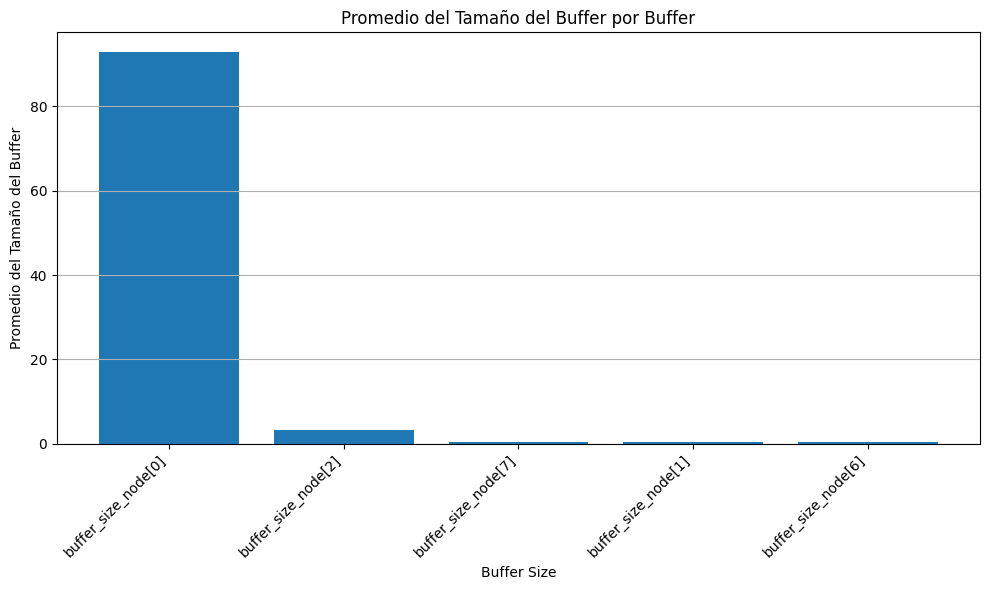

# Informe Lab4 2025 - Redes y Sistemas Distribuidos.

Integrantes:
* Gonzalez Juan Pablo.
* Guerrero Diego Alejandro.
* Madero Ismael.
* Pellegrino Milena.

## Analisis de red inicial.

Una red es un conjunto de nodos conectados entre si que facilitan el envio de paquetes.

Nodos: Miembros de la red que crean, envian y reciben paquetes. En su composicion tienen:
- App: Encargada de crear y recibir paquetes.
- Net: Encargada del reenvio de paquetes (Tanto a App como a Links).
- Links: Canal de comunicacion con otros nodos (Tienen cola y todo lo que reciben lo envian a Net).

Nodos de nuestra red: 
![Node[0]](img/Node.png)

En un principio nos fue proporcionada una red funcional para que testeemos y determinemos si dicha red cumple ser **equilibrada**, donde nosotros definimos qué significa que una red sea **equilibrada**.

Nuestra red: 

Empezaremos definiendo que es una red equilibrada, para eso dicha red debe cumplir:

1. No sobrecargar nodos si existe otra posibilidad.
2. Enviar paquetes por caminos cortos.

Dicho esto podremos concluir que una red equilibrada **envia paquetes por el camino más corto con menos congestion**.

Analizando dicha red podemos observar que su flujo de trabajo es el siguiente:

- Node[0] y Node[2] producen paquetes con destino a Node[5].
- Todos los paquetes son enviados en sentido de las agujas del reloj. 
Esto quiere decir que en la red dada Node[0] envia a Node[7] y todos los demas nodos envian al nodo con numero mas chico.

Ejemplo de ejecucion: A la izq ejecucion del Node[0], a la derecha ejecucion de red, notar que estos ejemplos no son sincrónicos. Los paquetes rojos son producidos por Node[0] y los azules por Node[2]: 
 

Ejecutando esta red durante 200 segundos podemos ver la sig. cantidad de paquetes que pasaron por alguna cola de salida: 

Puede apreciarse: 
1. La ausencia de las colas de Node[3], Node[4], y Node[5].
2. Node[2] y Node[1] son los que menor carga tienen.
3. Node[0] es el de mayor carga.
4. Node[7] y Node[6] poseen misma carga

Razonamiento:
1. Esto se debe a que no se envian paquetes por dichos nodos.
2. Solo envian paquetes producidos por Node[2].
3. Envia tanto los paquetes recibidos como los generados.
4. Enian paquetes producidos por Node[0] y Node[2].

## Tarea Diseño

Se nos solicitó diseñar una estrategia de enrutamiento, cabe aclarar que por el tiempo del laboratorio no elegimos un algoritmo muy complejo como por ejemplo el protocolo de vector de distancia o el enrutamiento de estado de enlace vistos en el teórico, nuestra idea del algoritmo fue la siguiente (A priori):
- Los nodos generadores comienzan con un paquete de “testeo".
- El paquete de testeo es enviado a ambos vecinos del nodo (esto es así, porque sabemos de antemano que es una red con topología anillo, es nuestro único supuesto y lo único que sabemos con respecto a la red).
- Este paquete guarda el delay correspondiente a lo que tarda en llegar al receptor.
- El receptor envía un paquete de feedback al nodo generador indicando cuál fue la mejor ruta (con respecto al tiempo demorado). 
    - En el caso que el delay sea el mismo se elige la ruta óptima la que se genera de acuerdo a las agujas del reloj. 
    - El paquete feedback se envía al nodo generador por la ruta óptima
- A partir de esta información el nodo generador  comienza con el envío de los datos por la ruta óptima. 
    - En el primer momento donde no se tiene un paquete de feedback, y todavía no sabemos cual es la mejor ruta, lo que hacemos es enviar los paquetes en el sentido de la aguja del reloj (esto lo hacemos para no tener paquetes esperando en el buffer)
    - Envía “x” cantidad de paquetes por esa ruta.
    - Después de los x paquetes vuelve a enviar un paquete de testeo para determinar si esa ruta sigue siendo la óptima (ya que puede cambiar debido al congestionamiento).

### EJEMPLO DEL FUNCIONAMIENTO DEL ALGORITMO: 

**Características:**
- Nodos generadores: node[1] y node[2].
- Nodo receptor: node[6]

**PASO 1:**
Los nodos generadores, comienzan enviando los paquetes en sentido de las agujas del reloj. Mientras tanto, node[1] y node[2] envían ese paquete “testeo” para ver cuál es la ruta más corta/menos congestionada con respecto al receptor.  
==== INSERTE IMAGEN ====

**PASO 2:**
El node[6] envía el paquete FeedBack a cada uno de los nodos generadores utilizando la ruta con menos delay.  
==== INSERTE IMAGEN ====

**PASO 3:**
Cuando llega el paquete FeedBack indicando la ruta correspondiente, node[1] y node[2] comienzan a enviar los datos generados por medio de la “ruta óptima”. La idea es llevar un contador con los paquetes enviados.  
==== INSERTE IMAGEN ====

**PASO 4:**
Una vez que se enviaron X cantidad de paquetes, se vuelve a enviar otro paquete de testeo desde los nodos generados por ambas rutas, para la reevaluación (no se deja de enviar paquetes de datos). Ya que la ruta más corta puede no ser la mejor opción, sino que también importa la congestión.  
==== INSERTE IMAGEN ====

**PASO 5:**
Go to PASO 2.
