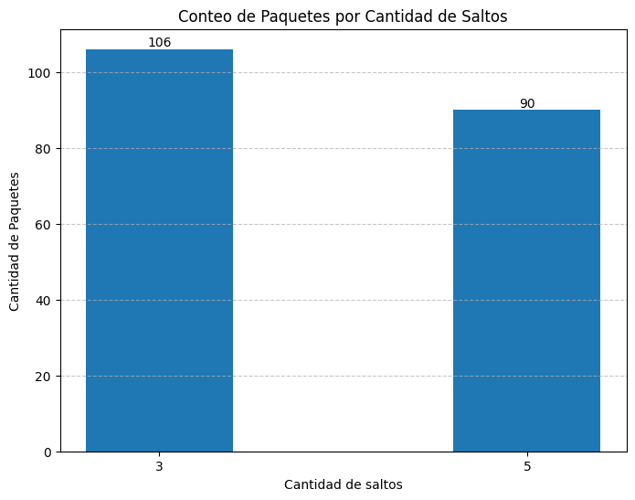

# Informe Lab4 2025 - Redes y Sistemas Distribuidos.

Integrantes:
* Gonzalez Juan Pablo.
* Guerrero Diego Alejandro.
* Madero Ismael.
* Pellegrino Milena.

## Analisis de red inicial.

Una red es un conjunto de nodos conectados entre si que facilitan el envio de paquetes.

Nodos: Miembros de la red que crean, envian y reciben paquetes. En su composicion tienen:
- App: Encargada de crear y recibir paquetes.
- Net: Encargada del reenvio de paquetes (Tanto a App como a Links).
- Links: Canal de comunicacion con otros nodos (Tienen cola y todo lo que reciben lo envian a Net).

Nodos de nuestra red: 
![Node[0]](img/Node.png)

En un principio nos fue proporcionada una red funcional para que testeemos y determinemos si dicha red cumple ser **equilibrada**, donde nosotros definimos qué significa que una red sea **equilibrada**.

Nuestra red: 

Empezaremos definiendo que es una red equilibrada, para eso dicha red debe cumplir:

1. No sobrecargar nodos si existe otra posibilidad.
2. Enviar paquetes por caminos cortos.

Dicho esto podremos concluir que una red equilibrada **envia paquetes por el camino más corto con menos congestion**.

Analizando dicha red podemos observar que su flujo  de trabajo es el siguiente:

- Todos los paquetes son enviados en sentido de las agujas del reloj. 
Esto quiere decir que en la red dada Node[0] envia a Node[7] y todos los demas nodos envian al nodo con numero mas chico.

### Caso 1 
- Node[0] y Node[2] producen paquetes con destino a Node[5].

Ejemplo de ejecucion: A la izq ejecucion del Node[0], a la derecha ejecucion de red, notar que estos ejemplos no son sincrónicos. Los paquetes rojos son producidos por Node[0] y los azules por Node[2]: 
 

#### ¿Qué métricas se obtienen? 

**Ejecutando esta red durante 200 segundos podemos ver lo sig:**

Promedio de paquetes en colas de salida: 

Puede apreciarse: 
1. La ausencia de las colas de Node[3], Node[4], y Node[5].
2. Node[0] es el de mayor carga.
3. Node[2] tiene ligeramente mayor carga que los nodos del punto 4.
4. Node[1], Node[6], y Node[7] son los que menor carga tienen.

Razonamiento:
1. Esto se debe a que no se envian paquetes por dichos nodos.
2. Envia tanto los paquetes recibidos desde Node[1] como los generados.
3. Unicamente envia los paquetes que genera.
4. Solo envian paquetes recibidos.

Observacion:
Los paquetes se generan mas rapido de lo que se envian, por eso el Node[2] y Node[0] tienen mayor congestion en sus colas.

Conteo de paquetes que pasaron por modulo net: 

Puede verse que el Node[2] con único rol generador produjo aproximadamente un total de 189 paquetes, se estima una cantidad de produccion similar en el Node[0] por lo que se observa logico que la carga sea aproximadamente mayor al doble que del Node[2] puesto que ademas de producir, recibe los producidos por Node[2]. 
Ademas puede verse la cantidad de paquetes que recibio el Node[5], una cantidad ligeramente mayor a lo producido por los generadores. 
En los demas nodos se ve un valor similar de manejo de paquetes pues estos solo reenvian.

Valores de los delays segun llegan: 

Se aprecia que los delays aumentan a medida que ocurre la ejecucion, esto ocurre pues hay sobrecongestionamiento producido en el Nodo[0], lo que genera cada vez mayores delays.

Cantidad de saltos: 

En esta grafica se ven que hay dos tipos de paquetes, los que llegan con 3 hops y los que llegan con 5. Producidos por Node[2] y Node[0] respectivamente. Se observan dominantes los paquetes de 3 Hops, esto indica que llegan aproximadamente un 17% mas paquetes producidos por Node[0]

#### ¿Cómo es el uso de los recursos de la red? ¿Se puede mejorar?

El uso de los recursos es sobreexigido, pues las colas no dan abasto a la produccion. Se puede mejorar modificando el algoritmo de envio de paquetes.

### Caso 2
- Todos los nodos envian a Node[5]

Ejemplo de ejecucion: 

Luego de 200 segs de ejecucion se recolectaron los sig. datos:

Promedio de paquetes en colas de salida: 

Conteo de paquetes que pasaron por modulo net: 

Valores de los delays segun llegan: 

Cantidad de saltos: 

Se nota bastante similar al Caso 1 exceptuando los delays que son bastante mayores en este ultimo caso. 
Ademas puede observarse que los Nodos mas lejanos en sentido contrario a las agujas del reloj son quienes menos paquetes efectivos envian.

#### Explore y determine a partir de qué valor de interArrivalTime se puede garantizar un equilibrio o estabilidad en la red. Justifique.

Testeando varios valores para el interArrival el primero que vi que garantiza un cierto equilibro es **exponential(8)**, pues las graficas para este caso son las siguientes: 
Buffers.png) 
Buffers2.png) 
Delays.png) 
Hops.png) 
Considero este valor como equilibrado pues no hay sobrecarga en la mayoria de colas a excepcion del Node[6] de todos modos la cantidad de paquetes que recibio el Node[5] es muy similar a la cantidad de paquetes que pasaron por el Node[6]. 
Ademas los delays se mantienen en los mismos valores aproximadamente, y no son crecientes. 
Se recibe una cantidad similar de paquetes de todos los nodos. 
Aunque la cantidad recibida por Node[5] ronda al rededor de 150 cuando en el caso de exponential(0.1) era de alrededor de 190, lo que marca una contra en favor de no tener una red saturada y recibir paquetes de todos los nodos.

### Conclusion

Viendo ambos casos podemos concluir que no es una red equilibrada, pues sobrecarga mucho las colas y los nodos no envian paquetes por los caminos mas cortos. 
Ademas para equilibrarla se retrasa mucho la produccion de paquetes. 
Puede mejorarse este algoritmo de enrutamiento si se opta por buscar rutas mas cortas. 
Por ejemplo, en el caso 1, los paquetes producidos por el Node[2] podrian ir por el Node[3], Node[4], Node[5]. 
De esta manera se aprovecha un camino no utilizado previamente que se encuentra libre y ademas las cantidad de Hops seria menor, pasando de 5 a 3.

### Extra:
Las graficas fueron generadas usando el sig. link de collab: [lab4_analisis](https://colab.research.google.com/drive/1AdbyTvdN3MwR7wmiGdik1NOO2emff0Gs?usp=sharing)