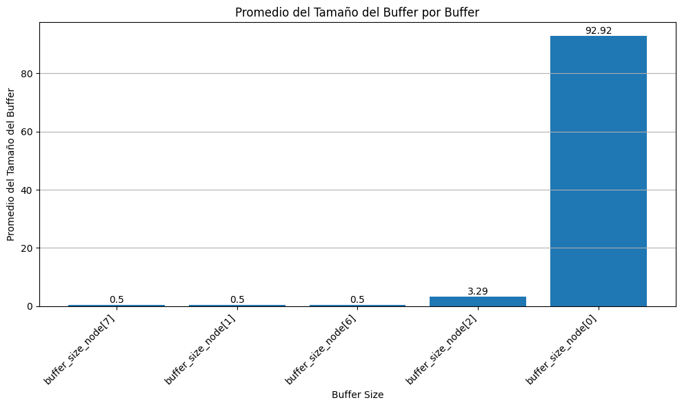
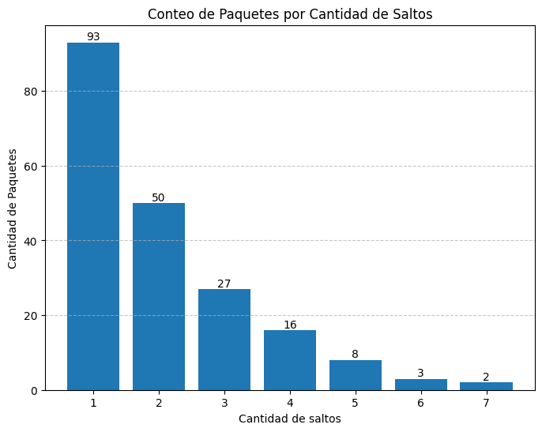

# Informe Lab4 2025 - Redes y Sistemas Distribuidos.

Integrantes:
* Gonzalez Juan Pablo.
* Guerrero Diego Alejandro.
* Madero Ismael.
* Pellegrino Milena.

## Analisis de red inicial.

Una red es un conjunto de nodos conectados entre si que facilitan el envio de paquetes.

Nodos: Miembros de la red que crean, envian y reciben paquetes. En su composicion tienen:
- App: Encargada de crear y recibir paquetes.
- Net: Encargada del reenvio de paquetes (Tanto a App como a Links).
- Links: Canal de comunicacion con otros nodos (Tienen cola y todo lo que reciben lo envian a Net).

Nodos de nuestra red: 
![Node[0]](img/Node.png)

En un principio nos fue proporcionada una red funcional para que testeemos y determinemos si dicha red cumple ser **equilibrada**, donde nosotros definimos qué significa que una red sea **equilibrada**.

Nuestra red: 

Empezaremos definiendo que es una red equilibrada, para eso dicha red debe cumplir:

1. No sobrecargar nodos si existe otra posibilidad.
2. Enviar paquetes por caminos cortos.

Dicho esto podremos concluir que una red equilibrada **envia paquetes por el camino más corto con menos congestion**.

Analizando dicha red podemos observar que su flujo  de trabajo es el siguiente:

- Todos los paquetes son enviados en sentido de las agujas del reloj. 
Esto quiere decir que en la red dada Node[0] envia a Node[7] y todos los demas nodos envian al nodo con numero mas chico.

### Caso 1 
- Node[0] y Node[2] producen paquetes con destino a Node[5].

Ejemplo de ejecucion: A la izq ejecucion del Node[0], a la derecha ejecucion de red, notar que estos ejemplos no son sincrónicos. Los paquetes rojos son producidos por Node[0] y los azules por Node[2]: 
 

#### ¿Qué métricas se obtienen? 

**Ejecutando esta red durante 200 segundos podemos ver lo sig:**

Promedio de paquetes en colas de salida: 

Puede apreciarse: 
1. La ausencia de las colas de Node[3], Node[4], y Node[5].
2. Node[0] es el de mayor carga.
3. Node[2] tiene ligeramente mayor carga que los nodos del punto 4.
4. Node[1], Node[6], y Node[7] son los que menor carga tienen.

Razonamiento:
1. Esto se debe a que no se envian paquetes por dichos nodos.
2. Envia tanto los paquetes recibidos desde Node[1] como los generados.
3. Unicamente envia los paquetes que genera.
4. Solo envian paquetes recibidos.

Observacion:
Los paquetes se generan mas rapido de lo que se envian, por eso el Node[2] y Node[0] tienen mayor congestion en sus colas.

Conteo de paquetes que pasaron por modulo net: 

Puede verse que el Node[2] con único rol generador produjo aproximadamente un total de 189 paquetes, se estima una cantidad de produccion similar en el Node[0] por lo que se observa logico que la carga sea aproximadamente mayor al doble que del Node[2] puesto que ademas de producir, recibe los producidos por Node[2]. 
Ademas puede verse la cantidad de paquetes que recibio el Node[5], una cantidad ligeramente mayor a lo producido por los generadores. 
En los demas nodos se ve un valor similar de manejo de paquetes pues estos solo reenvian.

Valores de los delays segun llegan: 

Se aprecia que los delays aumentan a medida que ocurre la ejecucion, esto ocurre pues hay sobrecongestionamiento producido en el Nodo[0], lo que genera cada vez mayores delays.

Cantidad de saltos: 

En esta grafica se ven que hay dos tipos de paquetes, los que llegan con 3 hops y los que llegan con 5. Producidos por Node[2] y Node[0] respectivamente. Se observan dominantes los paquetes de 3 Hops, esto indica que llegan aproximadamente un 17% mas paquetes producidos por Node[0]

#### ¿Cómo es el uso de los recursos de la red? ¿Se puede mejorar?

El uso de los recursos es sobreexigido, pues las colas no dan abasto a la produccion. Se puede mejorar modificando el algoritmo de envio de paquetes.

### Caso 2
- Todos los nodos envian a Node[5]

Ejemplo de ejecucion: 

Luego de 200 segs de ejecucion se recolectaron los sig. datos:

Promedio de paquetes en colas de salida: 

Conteo de paquetes que pasaron por modulo net: 

Valores de los delays segun llegan: 

Cantidad de saltos: 

Se nota bastante similar al Caso 1 exceptuando los delays que son bastante mayores en este ultimo caso. 
Ademas puede observarse que los Nodos mas lejanos en sentido contrario a las agujas del reloj son quienes menos paquetes efectivos envian.

#### Explore y determine a partir de qué valor de interArrivalTime se puede garantizar un equilibrio o estabilidad en la red. Justifique.

Testeando varios valores para el interArrival el primero que vi que garantiza un cierto equilibro es **exponential(8)**, pues las graficas para este caso son las siguientes: 
Buffers.png) 
Buffers2.png) 
Delays.png) 
Hops.png) 
Considero este valor como equilibrado pues no hay sobrecarga en la mayoria de colas a excepcion del Node[6] de todos modos la cantidad de paquetes que recibio el Node[5] es muy similar a la cantidad de paquetes que pasaron por el Node[6]. 
Ademas los delays se mantienen en los mismos valores aproximadamente, y no son crecientes. 
Se recibe una cantidad similar de paquetes de todos los nodos. 
Aunque la cantidad recibida por Node[5] ronda al rededor de 150 cuando en el caso de exponential(0.1) era de alrededor de 190, lo que marca una contra en favor de no tener una red saturada y recibir paquetes de todos los nodos.

### Conclusion

Viendo ambos casos podemos concluir que no es una red equilibrada, pues sobrecarga mucho las colas y los nodos no envian paquetes por los caminos mas cortos. 
Ademas para equilibrarla se retrasa mucho la produccion de paquetes. 
Puede mejorarse este algoritmo de enrutamiento si se opta por buscar rutas mas cortas. 
Por ejemplo, en el caso 1, los paquetes producidos por el Node[2] podrian ir por el Node[3], Node[4], Node[5]. 
De esta manera se aprovecha un camino no utilizado previamente que se encuentra libre y ademas las cantidad de Hops seria menor, pasando de 5 a 3.

## Tarea Diseño

Se nos solicitó diseñar una estrategia de enrutamiento, cabe aclarar que por el tiempo del laboratorio no elegimos un algoritmo muy complejo como por ejemplo el protocolo de vector de distancia o el enrutamiento de estado de enlace vistos en el teórico, nuestra idea del algoritmo fue la siguiente (A priori):
- En el primer momento donde no se tiene un paquete de feedback, y todavía no sabemos cual es la mejor ruta, lo que hacemos es enviar los paquetes en el sentido de la aguja del reloj (esto lo hacemos para no tener paquetes esperando en el buffer)
- Los nodos generadores comienzan con un paquete de “testeo" (Todos de manera sincrónica).
- El paquete de testeo es enviado a ambos vecinos del nodo (esto es así, porque sabemos de antemano que es una red con topología anillo, es nuestro único supuesto y lo único que sabemos con respecto a la red).
- El receptor envía un paquete de feedback al nodo generador indicando cuál fue la mejor ruta.
- El paquete feedback se envía al nodo generador por la ruta óptima (Esto es clave).
- A partir de saber por donde llega el feedback, el nodo generador comienza con el envío de los datos por la ruta óptima.
- Envía “x” cantidad de paquetes por esa ruta.
- Después de los "x" paquetes vuelve a enviar un paquete de testeo para determinar si esa ruta sigue siendo la óptima (ya que puede cambiar debido al congestionamiento).
- El "x" que nosotros elegimos (sin mucho criterio), es 30 (RESET_TESTING)(Se setea como constante en [Net.cc](Net.cc)).

### Aclaraciones:
- El tamaño tanto de los paquetes *test* como *feedBack* es la mitad que los paquetes generados por la capa de **App**.
- Los paquetes *test* y *feedBack* se generan en **Net** layer.

### EJEMPLO DEL FUNCIONAMIENTO DEL ALGORITMO:

**Características:**
- Nodos generadores: node[0] y node[2]
- Nodo receptor: node[5]

**PASO 1:**
Los nodos generadores, comienzan enviando los paquetes en sentido de las agujas del reloj. Mientras tanto, node[0] y node[2] envían ese paquete “testeo” para ver cuál es la ruta más corta/menos congestionada con respecto al receptor.  

**PASO 2:**
El node[5] envía el paquete FeedBack a cada uno de los nodos generadores utilizando la ruta con menos delay.  

**PASO 3:**
Cuando llega el paquete FeedBack indicando la ruta correspondiente, node[0] y node[2] comienzan a enviar los datos generados por medio de la “ruta óptima”. La idea es llevar un contador con los paquetes enviados. 

**PASO 4:**
Una vez que se enviaron X cantidad de paquetes, se vuelve a enviar otro paquete de testeo desde los nodos generados por ambas rutas, para la reevaluación (no se deja de enviar paquetes de datos). Ya que la ruta más corta puede no ser la mejor opción, sino que también importa la congestión.  

**PASO 5:**
Go to PASO 2.

### Problema a la vista:
Nuestro algoritmo de enrutamiento tiene una maravillosa caracteristica, es **dinámico**, esto quiere decir que cada cierto tiempo se vuelve a ejecutar la evaluación de ruta óptima. Si bien esto a priori parece buenisimo, detrás tiene una debilidad a tener en cuenta si usamos una simulación para probarlo:  

Supongamos que tenemos 2 nodos cualquiera generando paquetes y enviandolos ambos en el mismo sentido (horario o anti-horario) (ambos comienzan la simulación con 0 paquetes enviados). La descripción de nuestro algoritmo actualmente esconde cierta **"sincronización"** en la reevaluación de rutas de los nodos generadores, esto significa que al momento que estos 2 nodos reevaluen la mejor ruta es **altamente probable** que ambos elijan el sentido contrario puesto que aunque quizá sea el camino más largo, es el camino con menor congestión. Si ambos nodos cambian el sentido de envio de paquetes luego de la reevaluación esto volvería a generar congestión en el sentido elegido.  
En conclusión tenemos que si bien, el hecho de que el algoritmo sea dinámico es algo bueno. Nos encontramos con una ***sincronización involuntaria*** de reevaluación entre nodos es algo contraproducente.

### Solución encontrada:
La solución de este problema que puede manchar la eficiencia de nuestro algoritmo de enrutamiento no es trivial. Se trata de **forzar una desincronización de evaluación entre nodos**, esto no fue algo tan fácil de que se nos ocurra pero se logra de la siguiente manera:

- Todos los nodos generadores mandan un paquete test apenas arranca la simulación.
- Sin embargo cada nodo se inicializa con una cantidad distinta de paquetes enviados.
- Cantidad de paquetes enviados = (((indice del nodo) % 10) / 10) * RESET_TESTING.
- Entonces por ejemplo, los nodos con indice 1, 11, 21, 31, van a comenzar con un 10% de los paquetes necesarios para la reevaluación.
- Esto genera que todos los nodos hagan una evaluación sincronizada (la primera) pero luego se desincronizan para no tener el problema anteriormente mencionado.

## Análisis del algoritmo diseñado:

### CASO 1:
Adjunto algunas imágenes que pueden resultar relevantes para llegar a conclusines.

Podemos notar que el nodo 5 sigue siendo evidentemente el nodo con más carga lo cuál nos parece razonable puesto que es el destino de los nodos generadores.  

Este gráfico nos muestra y evidencia que la mayoría de las veces, la ruta más óptima es la más corta (sin embaro no siempre es así).  

El algoritmo que implementamos hizo reducir significantemente el delay.

En este gráfico podemos ver que poco tiempo después de la reevaluación de ruta óptima, el delay de los paquetes tiene una notable bajada, lo cuál indica que nuestro algoritmo tiene sentido y está bien implementado. Luego el delay comienza a aumentar lo cuál es lógico debido a la congestión.

### CASO 2:
Adjunto algunas imágenes que pueden resultar relevantes para llegar a conclusiones.

Este gráfico refleja equilibrio. Los nodos tienen una carga relativamente equitativa.

Este gráfico refleja que muchas veces, el camino más corto es el más rápido también. Llegaron muchos paquetes de un solo salto, es decir, de los nodos vecinos al receptor.

En este caso, no vemos tanta diferencia entre los valores de delay entre el algoritmo original y el algoritmo que diseñamos.

Acá podemos ver los eventos de test junto con el delay, lo que nos interesa obvservar es que los test no se ejecutan todos simultaneamente sino que están repartidos, lo cuál es importante.

### Extra:
Las graficas fueron generadas usando el sig. link de collab: [lab4_analisis](https://colab.research.google.com/drive/1AdbyTvdN3MwR7wmiGdik1NOO2emff0Gs?usp=sharing)