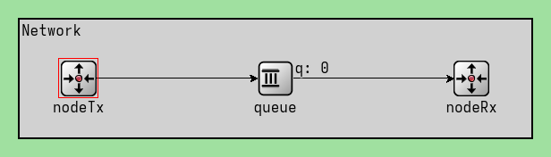
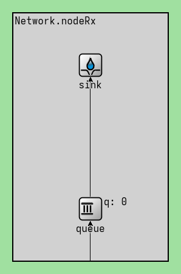
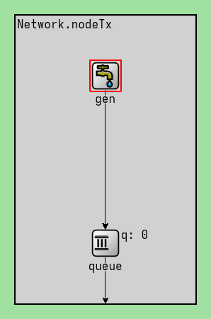
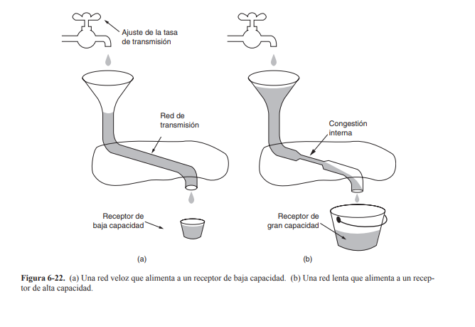

# Analísis de flujo y congestión en redes utilizando simulación discreta 

## Resumen
Descirbe lo que se va a encontrar nuestro lector, si lee nuestro trabajo. 
Prestenar el problema a trabajar, de que manera la trabajamos, pequena idea de solucion y describir un poco la estrcutura. 

El visual de bitbucket para MarkDown, no es el mejor, recomendamos verlo en otro lugar. 

## Integrantes
  - Guerrero Diego
  - Gonzalez Juan Pablo
  - Madero Ismael
  - Pellegrino Milena

## Índice

1. [Introducción](#introducción)
2. [Experimento 1](#experimento-1)
3. [Experimento 2](#experimento-2)
4. [Conclusiones](#conclusiones)
5. [Referencias](#referencias)
6. [Anexo](#anexo)

## Introducción

En este laboratorio nos centramos en la capa de transporte, con el objetivo de analizar el tráfico de red bajo tasas de datos acotadas y tamaño de buffers limitados, ademas de diseñar y proponer diferentes soluciones de control de congestión y flujo. 

Para poder realizar esto usamos Omnet++, una bibloteca con un marco de simulación en C++ destinado principalmente a la creación de simuladores de red, nosotros lo utilizamos para poder generar estos modelos de red que posteriormente analizamos. 

### Esquema de nuestra red

El esquema de red utilizado es bastante simple, que consta de tres elementos principales: 
1. nodeTx: nodo generador, es el que genera los paquetes de datos y los envía al siguiente componente (queue). 
2. queue: cola de paquetes, es un buffer donde los paquetes que llegan son almacenados hasta que se envía al nodo receptor. Sirve para, por ejemplo, si hay congestión, los paquetes se puedan quedar esperando en un lugar, sin que se pierdan. 
3. nodeRx: sink, el nodo receptor, es el encargado de recibir los datos que fueron enviados desde el nodo generador, los recibe una vez que fueron pasados por la queue.

Además cabe aclarar que internamente cada nodo cuenta con buffer (ver imágenes de abajo) con el objetivo de simular un poco mejor el comportamiento de un red **real**, por ejemplo para simular un retardo realista antes de que el paquete sea transmitido. 

|  |  |
|----------|----------|
|  |  |

### Flujo y congestión 
Como dijimos anteriormente en la parte de [Introducción](#introducción) queremos diseñar y proponer soluciones de control de congestión y de control de flujo; para esto damos una explicación breve de ambos conceptos para que se pueda entender uno de los objetivos del trabajo:

- **Control de flujo:** Es un mecanismo que regula la velocidad de transmisión de datos entre un emisor y un receptor para evitar sobrecargar los dispositivos y asegurar una comunicación eficiente. EL objetivo es evitar que el emisor envíe más datos de los que el receptor puede procesar, ya que esto podría causar pérdida de información. Para evitar que suceda esto se utilizan algoritmos (vistos en el teórico) que ajustan la velocidad de transmisión según la capacidad del receptor. 

- **Control de congestión:** Es una sobrecarga de la red. Ocurre cuando la cantidad de datos que circulan por la red supera la capacidad de la red, lo que provoca retrasos o peor aún la pérdida de paquetes. Esto se suele solucionar con técnicas como el control de tráfico (que lo que hacen en esencia es limitar la cantidad de datos emitidos) o alguna optimización de enrutamiento. 

### Simulación discreta
Para los análisis de los experimentos (tanto del experimento 1, como del experimento 2) realizamos simulaciones discretas, es decir, los eventos ocurren en momentos específicos y el tiempo ocurre en pasos discretos, nosotros utilizamos Omnet++. Hacerlo de esta manera nos permite evaluar el desempeño de una red sin la necesidad de tenerla físicamente.

# Experimento 1

Primeramente recordemos los parámetros de nuestra red, para este experimento:
Recordemos que en el archivo .ini se encuentran estos parámetros, obviamente se pueden modificar, pero los experimentos los fijamos con los siguientes: 

- Tamaño de los paquetes: 12500 bytes 
- Tamaño de los buffers: 
   - nodeRx: 200
   - nodeTx: 2000000 
   - queue (buffer del medio): 200
- Intervalo de generación: exponential(0.001), es decir, se elige un numero de la distribución exponencial con media 0.001 

- Desde el nodeTx hacia el nodo intermedio: 
   - Velocidad de tasa de datos: 1Mbps
   - Delay: 100us

Luego tenemos los parametros de el datarate y los delay de los demas nodos, que son lo que cambia en nuestros casos de estudios. (ambos datos se especifican en la parte de los casos de estudio.)

El objetivo de este experimento es poder analizar el comportamiento de la red al variar el intervalo de generación (entre 0.1s y 1.0s) esto es común en ambos experimentos. Lo que nosotros observamos para poder hacer el analísis es: 
1. El uso de las tres queue 
2. Relación entre carga transmitida y carga recibida (paquetes/segundo).
3. En el caso de que haya pérdidas, medirlas y analizarlas, a través de gráficos. 

## Caso de estudio 1

Primeramente recordemos la tasa de datos para este caso de estudio: 
- `queue.out --> { datarate = 0.5Mbps; } --> sink.in;` es decir, nuestra tasa de datos, desde el nodo intermedio hacia el sink es de 0.5Mbps
- `queue.out --> { datarate = 0.5Mbps; } --> nodeRx.in;` 

Para poder analizar este caso de estudio, se hicieron diferentes graficas, a partir de los datos extraidos en las simulaciones con los parametros establecidos anteriormente.

| Imagen | Descripción |
|--------|-------------|
|  | Llenada de buffer de queue. Este nodo tiene la mitad del datarate, sube linealmente hasta el máximo y luego se mantiene. Siempre tiene 200, saca uno y entra uno. |
|  | Tamaño del buffer del nodeTx. Se explica como evoluciona el tamaño del buffer a lo largo del tiempo. |
|  | Cómo afecta el tamaño del buffer a la cantidad de paquetes descartados. |
|  | Muestra la distribución final de los paquetes en los distintos tipos de buffers.  |
|  | Presenta los datos normalizados (dividido entre 200) sobre paquetes generados, usados y perdidos en nuestra red. |
|  | Muestra la cantidad de paquetes descartados en el tiempo.|
|  | Muestra la cantidad de paquetes generados, (cuantos se usaron y cuantos se generaron).  |
|  | Mostramos como la proporción de paquetes usados vs generados y su evolución en el tiempo.|

## Caso de estudio 2
Primeramente recordemos la tasa de datos para este caso de estudio:
- `queue.out --> { datarate = 1Mbps; } --> sink.in;` es decir, nuestra tasa de datos es de 1Mbps, el doble que el caso de estudio 1. 
- `queue.out --> { datarate = 0.5Mbps; delay = 100us; } --> nodeRx.in;`, es decir, es la misma tasa de datos (0.5 Mbps) del caso de estudio 1, pero ahora se agrega un retardo de 100 µs en la transmisión hacia NodeRx

Para poder analizar este caso de estudio, se hicieron diferentes graficas, a partir de los datos extraidos en las simulaciones con los parametros establecidos anteriormente.

|  |  |  |  |
|-----------|-----------|-----------|-----------|
|    |   |   |  |

## Preguntas

**¿Qué diferencia observa entre el caso de estudio 1 y 2? ¿Cuál es la fuente limitante en cada uno? Investigue sobre la diferencia entre control de flujo y control de congestión (ver Figura 6-22 del libro Tanenbaum).**

Recordemos que la imagen del Tanenbaum es esta: 

# Experimento 2

bla bla bla, contar las cosas de como disenamos, etc..

## Caso de estudio 1

explicacion graficos y toda la bola del experimento 1 

## Caso de estudio 2
explicacion graficos y toda la bola del experimento 2

## Preguntas

respuesta de la pregunta que esta en el informe

## Conclusiones

escribir una conclusion o algo asi

## Referencias

- [Documentación oficial de Omnet++](https://omnetpp.org/documentation/)
- [Manual de Omnet++](https://doc.omnetpp.org/omnetpp5/manual/)
- [Introducción a Omnet++ y c++ (filminas)](https://drive.google.com/file/d/1xx5pSrQE5PUczFH7eUAPKU23-dclSdeF/view)
- [Introducción a Omnet++ y c++ (video)](https://www.youtube.com/watch?v=hgRW5rK-CDE&t=1616s)
- [Graficas en Omnet++ con Python y Notebooks](https://www.youtube.com/watch?v=yL1gf04E2_E)
- [Curva de Carga Ofrecida vs Carga Util](https://www.youtube.com/watch?v=W8r8zSPjeAs)
- [Estructura de un informe](https://www.youtube.com/watch?v=yq8zjLZABe0)

Cabe aclarar que vimos el video sobre la estructura del informe, pero solo incluimos algunos apartados como abstract, referencias, introducción. Para los otros nos tomamos la libertad de divididir el informe en secciones de exp1 y exp2 y luego un apartado de conclusiones general. (en el video se proponia que en la introducción pongamos el análisis de los problemas en el caso1 y caso2, en una sección método se explique la tarea de diseño, etc; nosotros decidimos hacerlo de esta manera ya que nos parecio un poco mas prolijo y mas ordenado a la hora en la que alguien lo tenga que leer; igualmente tenemos en cuenta que esto puede ser subjetivo y podriamos haber seguido la alineación propuesta por la catedra). 

## Anexo

Hemos utilizado diferentes herramientas de Inteligencia Artificial a lo largo del laboratorio, en diferentes ocasiones y usos. 

1. Primeramente utilizamos [ChatGPT](https://chatgpt.com/) para entender algunas partes del código proporcionado por la cátedra, que al leer la documentación no nos quedaba del todo claro.

   1. 
      - **Prompt**: Podrías explicarme qué es lo que hace `par("algo")` en OMNeT++.
      - **Respuesta**: *Lo de `par("nombre")` significa que estás accediendo a un parámetro del módulo en OMNeT++. `par("nombre")` te da acceso al valor de un parámetro definido en el archivo .ned del módulo. Es como una variable configurable desde afuera del código C++.*
      - **Verificación**: Lo verificamos observando el código y viendo que lo que se encontraba adentro del paréntesis efectivamente era un parámetro en el archivo `.ned`. Luego de leer la respuesta de ChatGPT, volvíamos a leer la documentación con un poco más de conocimiento para poder entenderlo del todo.

   2. 
      - **Prompt**: ¿Podrías explicarme qué es lo que hace `exponential(0.001)` en el contexto de OMNeT++?
      - **Respuesta**: *Cuando escribís `exponential(0.001)` en OMNeT++, estás diciendo: "Quiero que este valor se genere aleatoriamente siguiendo una distribución exponencial con media 0.001 segundos (o sea, 1 milisegundo)."*
      - **Verificación**: En este caso lo preguntamos porque no encontrábamos fácilmente información sobre el funcionamiento de `exponential(0.001)`. Encontramos un [manual](https://doc-omnetpp-org.translate.goog/omnetpp/manual/?_x_tr_sl=en&_x_tr_tl=es&_x_tr_hl=es&_x_tr_pto=tc) sobre OMNeT++ pero cuando explicaba lo de `exponential` era bastante vago. Para verificar, probamos qué hacía y leímos el código para ver si tenía sentido.

   3. 
      - **Prompt**: ¿Estamos hacineod un proyecto en omentpp, segun la documentación de omentpp esto es lo que hace la función scheduleAt (insertamos una imágen de la doc) lo que yo entiendo es que scheduleAt es un mensaje para el mismo proceso que lo ejecuta esto es correcto?
      - **Respuesta**: *¡Exactamente! 🙌 En OMNeT++, scheduleAt(tiempo, mensaje) agenda un evento (mensaje) para que sea entregado al mismo módulo que lo programó, en el momento tiempo del reloj de simulación*
      - **Verificación**: Acá no verificamos muchos, ya que utilizamos la herramienta para poder ver si lo que habiamos leído sobre [scheduleAt](https://doc.omnetpp.org/omnetpp/apiclassomnetpp_1_1cSimpleModulehtml#a97c57271ca2fc95225ed8514750cac27)  era correcto o estabamos mal encaminados.

2. Utilización de [Gemini](https://gemini.google.com/), lo usamos al utilizar [Google Colab](https://colab.google/) muchas veces teníamos varios errores al hacer las gráficas, y la explicación del error que tiraba python o la librería que usabamos era muy vaga y no llegabamos a entenderla, por lo tanto como Colab tiene incorporado Gemini, lo utilizamos para que nos explique mejor estos errores: 
   1. 
      - **Prompt**: Porfavor, podrías explicarme este error: [insertabamos el error] ejemplo: `AttributeError: 'float' object has no attribute 'split' `
      - **Respuesta**: *The error message AttributeError: 'float' object has no attribute 'split' indicates that you are trying to apply the split() method to a float object, but this method is only available for strings. This is happening because time_gen, time_queue, time_sink, buffer_gen, buffer_queue, and buffer_sink variables are already lists of floats based on the Global variables provided. The line of code time_gen[0].split() tries to access the first element of time_gen, which is a float, and then apply the split() method to it. Since floats don't have a split() method, this causes an AttributeError.*
      - **Verificación**: La verificación era hacer lo que nos decía y ver si tenía razón. Cabe aclarar que para la mayoría no era 100% correcto, pero nos tiraba una idea de cual era el problema del error y pensando un poco se solucionaba. 
